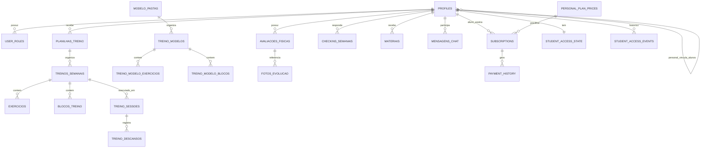

# PRD — FitConsult Hub

| Campo | Valor |
| --- | --- |
| Produto | FitConsult Hub |
| Tipo | Plataforma web/PWA de consultoria fitness online |
| Versão do documento | 1.0 |
| Estado documentado | Aplicação existente (`as is`) |
| Data de referência | 11/09/2026 |
| Fonte de verdade | Código-fonte, rotas, hooks, migrations do Supabase e `docs/stripe-mvp-runbook.md` |

## 1. Visão geral

O FitConsult Hub é uma plataforma SaaS para personal trainers venderem planos de consultoria, administrarem alunos e entregarem acompanhamento fitness em um único ambiente. O produto conecta três perfis — administrador da plataforma, personal trainer e aluno — e cobre a jornada desde a aquisição e cobrança até a prescrição, execução e acompanhamento dos treinos.

O núcleo do produto é a relação individual entre personal e aluno. O personal cria ou reutiliza modelos, aplica treinos por semana, organiza ciclos de treino, acompanha execução, avaliações, check-ins, feedbacks, mensagens, materiais e situação financeira. O aluno acessa uma experiência responsiva e instalável, consulta sua programação, registra a execução e acompanha a própria evolução.

Além da operação da consultoria, a plataforma possui um backoffice para gestão dos usuários, planos SaaS, assinaturas, pagamentos, conteúdo global, métricas e integridade operacional.

### 1.1 Problema

Personais que atendem online normalmente distribuem sua operação entre planilhas, mensagens, arquivos, meios de pagamento e ferramentas sem integração. Isso provoca:

- retrabalho na montagem e repetição de treinos;
- pouca visibilidade sobre frequência, progresso e alunos que precisam de atenção;
- comunicação e feedbacks sem contexto;
- materiais dispersos;
- controle manual de cobranças e liberação de acesso;
- uma experiência fragmentada para o aluno.

### 1.2 Proposta de valor

- Para o personal: centralizar prescrição, acompanhamento, relacionamento e receita.
- Para o aluno: ter um aplicativo simples, personalizado e mobile-first para seguir o plano e acompanhar a evolução.
- Para o administrador: controlar a operação SaaS, os planos, os acessos e a saúde financeira/técnica do produto.

### 1.3 Princípios do produto

- Mobile-first para a rotina do aluno e responsivo para todos os perfis.
- Segurança por vínculo: cada personal acessa somente os próprios alunos e conteúdos.
- Reutilização antes de repetição: biblioteca, modelos e templates reduzem trabalho manual.
- Fonte de verdade no backend: pagamento e acesso não dependem apenas do retorno visual do checkout.
- Acompanhamento orientado a sinais: pendências, inatividade, feedbacks e vencimentos devem ser visíveis.
- Personalização com identidade do profissional, sem perder consistência da plataforma.

## 2. Perfis e permissões

### 2.1 Administrador

Responsável pela operação do FitConsult Hub. Pode gerenciar usuários, personais, planos SaaS, assinaturas, pagamentos, conteúdo global, notificações, configurações e monitoramento.

### 2.2 Personal trainer

É o gestor de uma consultoria dentro da plataforma. Pode cadastrar e administrar seus alunos, prescrever treinos, criar conteúdo privado, usar conteúdo global conforme o plano contratado, acompanhar resultados, conversar com alunos, enviar materiais e gerenciar recebimentos.

### 2.3 Aluno

É vinculado a um personal por `profiles.personal_id`. Pode acessar apenas sua própria experiência e os conteúdos liberados pelo profissional: treinos, histórico, dados de acompanhamento, avaliações, materiais, chat, biblioteca e plano.

### 2.4 Matriz resumida

| Capacidade | Admin | Personal | Aluno |
| --- | :---: | :---: | :---: |
| Gerenciar usuários e planos SaaS | Sim | Não | Não |
| Gerenciar alunos vinculados | Sim | Sim, próprios | Não |
| Criar/editar prescrição | Supervisão | Sim | Não |
| Executar e concluir treino | Não | Visualiza | Sim |
| Criar conteúdo global | Sim | Não | Não |
| Criar conteúdo privado | Não | Sim | Não |
| Registrar avaliação/anamnese | Supervisão | Sim | Preenche/consulta conforme fluxo |
| Conversar no chat | Supervisão operacional | Sim | Sim |
| Configurar Stripe e preços ao aluno | Não | Sim | Não |
| Comprar/gerenciar plano da consultoria | Não | Não | Sim |
| Alterar acesso do aluno | Sim | Sim, próprios | Não |

## 3. Metas do projeto

### 3.1 Metas de produto

1. Reduzir o tempo gasto pelo personal para criar e aplicar uma prescrição semanal.
2. Aumentar a adesão do aluno por meio de uma experiência de execução clara e acessível no celular.
3. Concentrar acompanhamento, comunicação e histórico em uma única visão por aluno.
4. Automatizar a venda, renovação e liberação de acesso vinculadas ao pagamento.
5. Dar ao administrador visibilidade sobre crescimento, receita e falhas operacionais.
6. Permitir que o personal entregue uma experiência com sua marca, cores e mensagens.

### 3.2 Indicadores recomendados

Os valores-alvo dependem de uma linha de base ainda não registrada. O produto deve instrumentar, no mínimo:

| Objetivo | Indicador | Definição inicial |
| --- | --- | --- |
| Ativação do personal | Tempo até primeiro aluno com treino | Cadastro do personal → primeiro treino publicado |
| Ativação do aluno | Taxa de primeiro treino | Alunos que iniciam um treino em até 7 dias do cadastro |
| Aderência | Conclusão semanal | Treinos concluídos ÷ treinos previstos por semana |
| Engajamento | Alunos ativos semanais | Alunos com treino, check-in ou mensagem na semana |
| Operação | Alunos que exigem atenção | Inativos, planilha vencendo, pagamento pendente ou feedback não respondido |
| Receita | MRR e receita recebida | Receita recorrente ativa e pagamentos confirmados |
| Cobrança | Inadimplência | Assinaturas pendentes/atrasadas ÷ assinaturas vigentes |
| Retenção | Churn de personais | Cancelamentos ÷ base ativa no período |
| Confiabilidade | Falhas de webhook | Eventos Stripe não processados com sucesso |
| Suporte | Erros críticos por usuário ativo | Falhas de acesso, execução ou edição registradas |

### 3.3 Fora do escopo atual

- Aplicativos nativos para iOS ou Android; o canal atual é uma PWA.
- Marketplace/loja funcional de produtos digitais; a interface existente está marcada como “Em breve”.
- Videochamadas ou aulas ao vivo.
- Prescrição nutricional estruturada; dietas podem ser enviadas como materiais.
- Integração com wearables, balanças ou plataformas esportivas.
- Anexos binários no chat; atualmente o chat orienta o uso de links ou da área de Materiais.
- Cadastro público irrestrito de novos personais; o fluxo previsto é criação pelo administrador.

## 4. Escopo funcional

### 4.1 Autenticação, identidade e acesso

- **RF-AUT-01** — O sistema deve autenticar por e-mail e senha usando Supabase Auth.
- **RF-AUT-02** — O sistema deve suportar recuperação e redefinição de senha.
- **RF-AUT-03** — Após login, o usuário deve ser direcionado conforme o papel: `/admin`, `/personal` ou `/aluno`.
- **RF-AUT-04** — Rotas privadas devem impedir acesso de usuários não autenticados ou com papel incompatível.
- **RF-AUT-05** — O administrador deve poder criar contas de personal e aluno; o personal deve poder criar contas de seus alunos.
- **RF-AUT-06** — O cadastro iniciado em uma página pública deve criar um aluno já vinculado ao personal correspondente.
- **RF-AUT-07** — Uma conta de aluno já vinculada a outro personal não deve ser reassociada silenciosamente.
- **RF-AUT-08** — O estado de acesso do aluno deve ser recalculado no backend e refletido em tempo real na interface.
- **RF-AUT-09** — Alunos bloqueados devem ser enviados para `/acesso-suspenso`, com motivo, mensagem do personal e caminho de regularização quando aplicável.
- **RF-AUT-10** — O acesso do personal pode ser condicionado a uma assinatura SaaS ativa quando o administrador habilitar essa regra.

### 4.2 Gestão de alunos

- **RF-ALN-01** — O personal deve cadastrar, consultar, buscar, editar e remover alunos próprios.
- **RF-ALN-02** — O personal deve poder arquivar/restaurar alunos, preservando o histórico; o arquivamento exige bloqueio prévio.
- **RF-ALN-03** — A listagem deve separar/indicar ativos, bloqueados e arquivados.
- **RF-ALN-04** — Cada cartão de aluno deve consolidar sinais de treino, planilha, financeiro, check-in, feedback e chat.
- **RF-ALN-05** — O sistema deve destacar alunos prioritários, incluindo inatividade, vencimentos, inadimplência, feedbacks sem resposta e mensagens não lidas.
- **RF-ALN-06** — O personal deve poder personalizar a cor do cartão do aluno.
- **RF-ALN-07** — O personal deve poder pausar, suspender, liberar ou liberar temporariamente o acesso e consultar o histórico das alterações.
- **RF-ALN-08** — A visão detalhada deve reunir Geral, Treinos, Histórico, Materiais, Avaliação, Anamnese, Feedbacks Semanais, Feedbacks de Treino, Chat e Financeiro.
- **RF-ALN-09** — Ações destrutivas devem exigir confirmação e respeitar o vínculo entre personal e aluno.

### 4.3 Planejamento e prescrição de treinos

- **RF-TRN-01** — O personal deve criar uma planilha/ciclo com nome, início, duração em semanas, características do ciclo e observações.
- **RF-TRN-02** — Somente uma planilha deve permanecer ativa por aluno; a criação de uma nova encerra a anterior.
- **RF-TRN-03** — O sistema deve permitir renovar ciclos e importar treinos de períodos anteriores.
- **RF-TRN-04** — A semana base pode ser replicada para as demais semanas do ciclo, preservando exercícios, grupos, blocos e múltiplos treinos no mesmo dia.
- **RF-TRN-05** — O personal deve definir qual semana de treino está ativa para o aluno.
- **RF-TRN-06** — O sistema deve permitir zero, um ou vários treinos por dia, ordenados dentro do dia.
- **RF-TRN-07** — O personal deve criar, editar, reordenar, duplicar, limpar e excluir treinos, exercícios e blocos.
- **RF-TRN-08** — Um exercício deve suportar nome, séries, repetições, carga recomendada, descanso, vídeo, observações e referência à biblioteca.
- **RF-TRN-09** — Exercícios podem ser agrupados, com tipo, ordem interna e descanso entre grupos.
- **RF-TRN-10** — Blocos devem suportar alongamento/mobilidade, cardio, aquecimento, principal, finalização e outros, com configurações específicas e links.
- **RF-TRN-11** — O personal deve salvar treinos e blocos como modelos/templates reutilizáveis.
- **RF-TRN-12** — Modelos privados devem ser organizáveis em pastas e subpastas, com busca, ordenação, tags, categorias e movimentação.
- **RF-TRN-13** — Modelos globais devem ser somente leitura na origem e utilizáveis conforme os recursos do plano SaaS do personal.
- **RF-TRN-14** — O personal deve poder aplicar um modelo a um aluno e escolher os dias/semana de destino.
- **RF-TRN-15** — O treino deve ser exportável em PDF e Word, opcionalmente com papel timbrado do personal.
- **RF-TRN-16** — Exclusões lógicas de exercícios/blocos devem preservar consistência histórica onde aplicável.

### 4.4 Biblioteca de exercícios

- **RF-BIB-01** — O personal deve manter uma biblioteca própria de exercícios.
- **RF-BIB-02** — Cada item deve aceitar nome, descrição, grupo muscular, equipamento, dificuldade, vídeo e thumbnail.
- **RF-BIB-03** — A biblioteca deve permitir busca e filtros por grupo, equipamento e nível.
- **RF-BIB-04** — O exercício escolhido na biblioteca deve poder ser adicionado à prescrição mantendo sua referência de origem.
- **RF-BIB-05** — O administrador deve poder promover/criar exercícios globais.
- **RF-BIB-06** — A biblioteca global deve respeitar as features e o nível do plano SaaS do personal.
- **RF-BIB-07** — O aluno pode consultar a biblioteca em modo de leitura conforme a configuração de navegação do personal.

### 4.5 Execução do treino pelo aluno

- **RF-EXE-01** — O aluno deve visualizar a programação da semana e abrir cada treino permitido.
- **RF-EXE-02** — A execução deve mostrar exercícios, agrupamentos, blocos, instruções e links demonstrativos.
- **RF-EXE-03** — O aluno deve iniciar, pausar, retomar e finalizar uma sessão cronometrada.
- **RF-EXE-04** — O sistema deve registrar duração total, pausas e descansos da sessão.
- **RF-EXE-05** — O aluno deve marcar séries, exercícios e blocos como concluídos.
- **RF-EXE-06** — O aluno deve registrar o peso/carga realmente executado e consultar a progressão de carga.
- **RF-EXE-07** — Ao concluir, o aluno deve visualizar um resumo e poder enviar um comentário/feedback.
- **RF-EXE-08** — A conclusão deve atualizar calendário, indicadores de frequência e notificações do personal.
- **RF-EXE-09** — O histórico mensal deve permitir consultar treinos passados sem alterar a prescrição histórica.

### 4.6 Anamnese, check-ins e avaliações

- **RF-ACM-01** — O aluno deve preencher uma anamnese inicial com dados pessoais, objetivos, rotina, hábitos, histórico clínico, limitações, preferências e aceite do termo.
- **RF-ACM-02** — O personal deve consultar a anamnese e selecionar campos críticos como destaques para a montagem do treino.
- **RF-ACM-03** — O personal deve configurar check-in semanal, prazo, lembretes e eventual bloqueio da rotina de treino.
- **RF-ACM-04** — O aluno deve registrar semanalmente peso, sono, alimentação, empenho, saúde, dores, estado emocional, dificuldade, mudanças e dúvidas.
- **RF-ACM-05** — O personal deve consultar histórico, indicadores e evolução dos check-ins.
- **RF-ACM-06** — O personal deve registrar avaliações físicas datadas e manter histórico, inclusive avaliações incompletas/campos pendentes.
- **RF-ACM-07** — A avaliação deve cobrir composição corporal e perimetrias, flexibilidade, teste cardiorrespiratório, postura, triagem e observações.
- **RF-ACM-08** — O sistema deve calcular/apresentar métricas derivadas quando houver dados suficientes, como IMC, composição e evolução.
- **RF-ACM-09** — O personal deve adicionar fotos de evolução por data/ângulo em armazenamento privado.
- **RF-ACM-10** — Comparações “antes e depois” devem ser explicitamente liberadas pelo personal para o aluno.
- **RF-ACM-11** — O aluno deve ter uma visão somente leitura das avaliações e comparativos liberados.

### 4.7 Comunicação, feedbacks e materiais

- **RF-COM-01** — Personal e aluno vinculados devem trocar mensagens de texto em tempo real.
- **RF-COM-02** — O chat deve indicar mensagens lidas/não lidas e manter contadores por conversa.
- **RF-COM-03** — Deve ser possível responder, editar, excluir para si, excluir para todos, fixar e favoritar mensagens conforme permissão.
- **RF-COM-04** — O personal deve pesquisar e filtrar conversas, inclusive não lidas e favoritas.
- **RF-COM-05** — O personal deve poder transmitir uma mensagem para vários alunos.
- **RF-COM-06** — O personal deve configurar uma mensagem inicial/boas-vindas do chat.
- **RF-COM-07** — Feedbacks semanais e de treino devem aceitar respostas contextuais, com encadeamento e estado de leitura por participante.
- **RF-COM-08** — O personal deve enviar materiais em PDF, JPG ou PNG, com até 10 MB, título, descrição e categoria (`treino`, `dieta`, `avaliacao` ou `outro`).
- **RF-COM-09** — O aluno deve visualizar e baixar seus materiais; o personal deve também removê-los.
- **RF-COM-10** — O sistema deve disponibilizar atalho de contato por WhatsApp quando houver telefone configurado.

### 4.8 Notificações

- **RF-NOT-01** — O sistema deve persistir notificações no aplicativo com tipo, título, mensagem, destinatário, dados de ação e estado de leitura.
- **RF-NOT-02** — Novas notificações devem aparecer em tempo real e poder gerar feedback visual/sonoro.
- **RF-NOT-03** — Usuários podem autorizar notificações Web Push; inscrições revogadas devem ser invalidadas.
- **RF-NOT-04** — Notificações devem direcionar à área relacionada, como chat, treino, feedback ou plano.
- **RF-NOT-05** — O sistema deve avisar personal e aluno sobre planilhas a 7 dias, a 3 dias e expiradas, sem duplicar lembretes.
- **RF-NOT-06** — Mensagens e feedbacks devem notificar o destinatário; o conteúdo do push deve ser limitado para não expor texto excessivo na tela bloqueada.

### 4.9 Financeiro do personal e cobrança do aluno

- **RF-FIN-01** — O personal deve conectar sua própria conta Stripe via Stripe Connect.
- **RF-FIN-02** — O sistema deve mostrar se a conta está apta a cobrar e receber (`charges_enabled` e `payouts_enabled`) e listar pendências de onboarding.
- **RF-FIN-03** — O personal deve configurar preços em BRL para planos mensal, trimestral, semestral e anual, ativá-los e sincronizá-los com produtos/preços Stripe.
- **RF-FIN-04** — O painel deve exibir valor bruto, taxa estimada, líquido estimado e desconto de cada periodicidade em relação ao valor mensal cheio.
- **RF-FIN-05** — O aluno deve poder contratar um plano por Stripe Checkout somente quando a conta do personal e o preço estiverem prontos.
- **RF-FIN-06** — O webhook deve ser a fonte de verdade para criar/atualizar assinatura e histórico de pagamento; o `success_url` não libera acesso sozinho.
- **RF-FIN-07** — O processamento de webhooks deve ser idempotente.
- **RF-FIN-08** — O personal deve poder registrar pagamentos manuais com valor, vencimento, método e observações.
- **RF-FIN-09** — O painel deve mostrar receita do mês, mês anterior, últimos 12 meses, previsão mensal, comparação anual, inadimplência, gráficos e histórico filtrável.
- **RF-FIN-10** — O personal deve visualizar alunos inadimplentes.
- **RF-FIN-11** — Para assinaturas Stripe, o personal deve poder cancelar ao fim do ciclo, reativar renovação, trocar plano sem rateio proporcional, abrir o portal do cliente e cancelar imediatamente.
- **RF-FIN-12** — O aluno deve consultar plano, situação, validade e histórico e acessar checkout/portal conforme o estado da assinatura.

### 4.10 Página pública e personalização

- **RF-PUB-01** — Cada personal ativo deve possuir um slug público único e normalizado.
- **RF-PUB-02** — O personal deve poder habilitar/desabilitar sua página pública, copiar o link e abri-lo para conferência.
- **RF-PUB-03** — A página pública deve expor somente nome, marca, mensagem comercial, prontidão da Stripe e preços ativos necessários para venda.
- **RF-PUB-04** — A seleção de um plano deve levar ao cadastro/login preservando o slug do personal e a periodicidade escolhida.
- **RF-PUB-05** — O personal deve configurar nome comercial, logo, cor principal, títulos/mensagens de boas-vindas e jornada.
- **RF-PUB-06** — O personal deve personalizar os cards e a ordem dos componentes do dashboard do aluno.
- **RF-PUB-07** — O personal deve enviar um papel timbrado A4 para exportações.
- **RF-PUB-08** — Interfaces autenticadas devem oferecer tema claro, escuro ou do sistema.

### 4.11 Administração da plataforma

- **RF-ADM-01** — O dashboard deve apresentar KPIs de usuários, personais, alunos, assinaturas e receita, além de atividade e ações rápidas.
- **RF-ADM-02** — O administrador deve criar, ativar/desativar e consultar usuários e seus papéis.
- **RF-ADM-03** — O administrador deve gerenciar personais, seus planos SaaS e regras de acesso dos respectivos alunos.
- **RF-ADM-04** — O administrador deve criar e editar planos SaaS, com preço, limite de alunos, nível e features (`acesso_plataforma`, `biblioteca_global`, `modelos_globais`).
- **RF-ADM-05** — O administrador deve acompanhar e operar assinaturas e pagamentos da plataforma.
- **RF-ADM-06** — O administrador deve criar/promover/despromover modelos, pastas e exercícios globais, definindo nível mínimo quando aplicável.
- **RF-ADM-07** — O sistema deve gerar relatórios mensais, anuais e personalizados e permitir exportação.
- **RF-ADM-08** — Analytics deve apresentar evolução de receita, crescimento de usuários, novas assinaturas, segmentação e performance.
- **RF-ADM-09** — O administrador deve consultar e administrar notificações/alertas da plataforma.
- **RF-ADM-10** — O monitoramento deve destacar status Stripe Connect, webhooks falhos, assinaturas vencidas ainda pagas, alunos sem personal e preços ativos sem `stripe_price_id`.
- **RF-ADM-11** — Ações administrativas relevantes devem ser registradas em log de atividade.
- **RF-ADM-12** — Controles exibidos como backup/cache só devem ser considerados entregues quando executarem uma operação real; hoje são apenas feedback de interface.

## 5. Regras de negócio

### 5.1 Vínculo e isolamento

1. Um aluno possui no máximo um `personal_id` ativo no modelo atual.
2. O personal só pode operar dados de alunos vinculados a ele.
3. O administrador possui visão transversal para operação e suporte.
4. Conteúdo privado pertence ao personal; conteúdo global pertence à plataforma e é administrado apenas pelo admin.

### 5.2 Acesso do aluno

1. O estado efetivo deve ser materializado em `student_access_state` e derivado dos eventos, configurações e pagamento.
2. Estados de interface: `ativo`, `pausado`, `suspenso` e `pagamento_pendente`.
3. A regra individual do aluno substitui a configuração geral de cobrança do personal quando estiver definida.
4. O evento manual mais recente de pausa, suspensão ou liberação tem prioridade sobre a regra financeira.
5. A liberação pode ser permanente ou temporária; ao expirar, o acesso deve ser recalculado.
6. Se pagamento for obrigatório, somente assinatura com `status_pagamento = pago` e `data_expiracao > agora` é vigente.
7. Toda mudança deve manter histórico com ator, origem, motivo, mensagem ao aluno, observação e data.
8. Mudanças relevantes devem refletir sem novo login, via atualização em tempo real.

### 5.3 Planilhas e treinos

1. A semana é identificada pela data de início da semana e cada treino possui `dia_semana`.
2. Uma planilha tem estados `ativa`, `encerrada` ou `renovada`.
3. O vencimento da planilha gera avisos; no comportamento atual, o bloqueio efetivo depende da regra de acesso, não apenas da data da planilha.
4. A replicação deve copiar somente treinos com conteúdo e gerar novos IDs para entidades e agrupamentos.
5. Alterações na prescrição não devem apagar silenciosamente dados históricos de execução.
6. Um treino concluído deve permanecer consultável no histórico.

### 5.4 Pagamentos

1. Existem dois domínios de cobrança distintos:
   - assinatura SaaS do personal com a plataforma (`assinaturas`, `pagamentos`, `planos`);
   - assinatura do aluno com o personal (`subscriptions`, `payment_history`, `personal_plan_prices`).
2. A moeda operacional da oferta pública é BRL.
3. O checkout do aluno usa cobrança direta na conta conectada do personal.
4. Chaves secretas da Stripe e service role nunca devem ser expostas no frontend.
5. Eventos Stripe duplicados não podem duplicar pagamentos ou assinaturas.
6. Falha de pagamento deve atualizar o status e, quando a cobrança controlar o acesso, bloquear o aluno.
7. Cancelamento ao fim do período mantém acesso até a expiração vigente.
8. A troca de periodicidade usa `proration_behavior=none`; a Stripe ainda pode reiniciar o ciclo de cobrança.

### 5.5 Conteúdo por nível de plano

1. Planos SaaS possuem nível de 1 a 4, limite de alunos e flags explícitas de recurso.
2. Biblioteca e modelos globais são liberados conforme as features do plano; a interface atual indica modelos globais a partir do plano Profissional.
3. O administrador pode definir `min_plan_level` em pastas/modelos globais.
4. Copiar um modelo global deve criar uma versão utilizável sem permitir ao personal alterar a origem global.

## 6. Estrutura de páginas

### 6.1 Rotas públicas e comuns

| Rota | Público | Objetivo |
| --- | --- | --- |
| `/` | Todos | Redirecionar para a área do papel autenticado ou para login |
| `/inicio` | Todos | Landing institucional com entrada para aluno e personal |
| `/p/:slug` | Todos | Página pública de venda do personal |
| `/auth` | Todos | Login, cadastro permitido pelo contexto e recuperação de senha |
| `/reset-password` | Todos | Definir nova senha após recuperação |
| `/acesso-suspenso` | Aluno autenticado | Explicar bloqueio e oferecer regularização/contato |
| `*` | Todos | Página não encontrada |

### 6.2 Área do personal

| Rota | Estrutura principal |
| --- | --- |
| `/personal` | Dashboard com alunos prioritários, treinos do dia/semana, alertas, mensagens, alunos, atividade/inatividade e feedbacks; configurações de marca e dashboard do aluno |
| `/alunos` | Lista, busca, filtros, criação, edição, acesso, arquivamento e indicadores dos alunos |
| `/aluno/:id` | Geral; Treinos; Histórico; Materiais; Avaliação; Anamnese; Feedbacks Semanais; Feedbacks de Treino; Chat; Financeiro |
| `/chat` | Central de conversas e envio em massa |
| `/biblioteca` | Biblioteca própria/global de exercícios |
| `/financeiro` | Stripe Connect, preços, indicadores, gráficos, histórico, inadimplência e ações de assinatura |

### 6.3 Área do aluno

`/aluno` é uma página única com seções internas selecionáveis por estado/query string:

| Seção | Conteúdo |
| --- | --- |
| Início | Frequência, mensagens, boas-vindas, atalhos e jornada, em ordem configurável |
| Meus dados | Anamnese, check-ins e avaliações liberadas |
| Treinos | Semana ativa, execução, cargas, blocos e feedback final |
| Chat | Conversa com o personal |
| Histórico | Calendário mensal de treinos |
| Materiais | Visualização e download de arquivos recebidos |
| Planos | Assinatura, pagamentos, checkout e portal |
| Biblioteca | Consulta de exercícios, vídeos e instruções |
| Avaliação | Atalho para os dados de acompanhamento |

No mobile, a navegação primária mantém Início, Treinos e Chat na barra inferior e move os itens adicionais para um menu. A composição pode variar conforme a configuração do personal.

### 6.4 Área administrativa

| Rota | Objetivo |
| --- | --- |
| `/admin` | Visão geral e KPIs |
| `/admin/usuarios` | Gestão de usuários |
| `/admin/personals` | Gestão de personal trainers e seus acessos/planos |
| `/admin/assinaturas` | Assinaturas SaaS dos personais |
| `/admin/pagamentos` | Pagamentos da plataforma |
| `/admin/planos` | Catálogo de planos SaaS e features |
| `/admin/conteudos-globais` | Modelos, pastas e exercícios globais |
| `/admin/relatorios` | Relatórios e exportações |
| `/admin/analytics` | Receita, crescimento, segmentação e performance |
| `/admin/notificacoes` | Central de notificações e alertas |
| `/admin/monitoramento` | Integridade Stripe, assinaturas, vínculos e preços |
| `/admin/configuracoes` | Regras gerais e configurações da plataforma |

## 7. Fluxos principais

### 7.1 Aquisição e assinatura do aluno

1. O personal conecta a Stripe e sincroniza seus preços.
2. Publica e compartilha `/p/:slug`.
3. O visitante escolhe uma periodicidade.
4. O cadastro/login mantém `personal` e `plan` na URL.
5. A conta é criada/vinculada ao personal.
6. O aluno inicia o Stripe Checkout.
7. A Stripe confirma o evento no webhook.
8. O backend grava assinatura/pagamento e recalcula o acesso.
9. O aluno acessa `/aluno`; se a confirmação ainda não chegou, vê o estado pendente sem liberação indevida.

### 7.2 Onboarding e prescrição

1. Admin cria o personal; personal cria ou recebe o novo aluno.
2. O aluno preenche a anamnese e, quando configurado, o check-in obrigatório.
3. O personal revisa restrições e destaca informações relevantes para o treino.
4. Cria um ciclo/planilha ou renova/importa um ciclo anterior.
5. Monta a semana manualmente ou aplica modelos privados/globais.
6. Configura exercícios, grupos, blocos e múltiplos treinos por dia.
7. Replica/sincroniza a programação para o período e define a semana ativa.
8. O aluno recebe a programação atualizada.

### 7.3 Execução e feedback

1. O aluno abre Treinos e escolhe o treino do dia.
2. Inicia a sessão e acompanha cronômetro/descansos.
3. Marca séries, exercícios e blocos; registra a carga executada.
4. Finaliza o treino e envia comentário opcional.
5. O sistema persiste sessão, conclusão e feedback.
6. Dashboard, calendário e sinais do personal são atualizados.
7. O personal consulta o feedback e responde no próprio contexto ou pelo chat.

### 7.4 Acompanhamento do personal

1. O dashboard agrega alunos que exigem atenção.
2. O personal abre o detalhe do aluno a partir do sinal relevante.
3. Analisa treinos, cargas, avaliações, fotos, check-ins, mensagens e financeiro.
4. Ajusta a prescrição, responde feedbacks, envia material ou altera o acesso.
5. A ação gera atualização e, quando aplicável, notificação ao aluno.

### 7.5 Suspensão e regularização

1. Um evento manual ou financeiro recalcula `student_access_state`.
2. Se `allowed = false`, a rota protegida leva a `/acesso-suspenso`.
3. A tela diferencia pausa/suspensão de pendência financeira.
4. Em pendência financeira, apresenta planos/checkout; nos demais casos, apresenta mensagem e WhatsApp do personal.
5. Pagamento confirmado ou liberação manual atualiza o estado em tempo real e restaura o acesso.

## 8. Modelo de dados

### 8.1 Relações centrais



### 8.2 Catálogo de entidades

#### Identidade e acesso

| Entidade | Responsabilidade | Campos/chaves relevantes |
| --- | --- | --- |
| `profiles` | Perfil comum e vínculo do tenant | `id`, `nome`, `email`, `telefone`, `personal_id`, `is_active`, `archived_at`, regra de pagamento, `public_slug` |
| `user_roles` | Papel do usuário | `user_id`, `role` (`admin`, `personal`, `aluno`) |
| `student_access_state` | Estado efetivo e materializado do aluno | `allowed`, `status`, `source`, pagamento vigente, evento efetivo, liberação temporária |
| `student_access_events` | Histórico imutável das causas de acesso | aluno, ator, origem, efeito, prioridade, motivo, mensagem, metadados |
| `student_access_logs` | Log legado/compatibilidade de alterações | antes/depois, ator, motivo e observações |
| `activity_logs` | Auditoria administrativa/operacional | usuário, ação, descrição, IP, user agent, detalhes |

#### Treinos e conteúdo

| Entidade | Responsabilidade |
| --- | --- |
| `planilhas_treino` | Ciclos com período, status e características |
| `treino_semana_ativa` | Semana apresentada como ativa para o aluno |
| `treinos_semanais` | Treinos prescritos por semana/dia, inclusive múltiplos no mesmo dia |
| `exercicios` | Itens executáveis, agrupamentos, prescrição, carga realizada e conclusão |
| `blocos_treino` | Blocos complementares e configurações por tipo |
| `treino_sessoes` | Início, pausa, fim e duração de uma execução |
| `treino_descansos` | Intervalos registrados durante a sessão |
| `exercises_library` | Biblioteca privada/global de exercícios |
| `treino_modelos` | Modelos privados/globais e linhagem da cópia |
| `treino_modelo_exercicios` | Exercícios pertencentes ao modelo |
| `treino_modelo_blocos` | Blocos pertencentes ao modelo |
| `modelo_pastas` | Hierarquia para modelos, inclusive espaços globais |
| `bloco_templates` / `bloco_template_pastas` | Templates reutilizáveis de blocos |

#### Acompanhamento

| Entidade | Responsabilidade |
| --- | --- |
| `anamnese_inicial` | Questionário inicial completo do aluno |
| `anamnese_treino_destaques` | Campos da anamnese selecionados pelo personal para prescrição |
| `configuracao_checkins` | Obrigatoriedade, prazo, lembrete e bloqueio de check-in |
| `checkins_semanais` | Respostas e indicadores semanais do aluno |
| `avaliacoes_fisicas` | Avaliações, medidas, composição, flexibilidade, cardio, postura e triagem |
| `fotos_evolucao` | Metadados e localização privada de fotos |
| `foto_comparativos_liberados` | Pares antes/depois liberados ao aluno |

#### Comunicação e arquivos

| Entidade | Responsabilidade |
| --- | --- |
| `mensagens_chat` | Mensagens, resposta, leitura, edição, exclusão, favorito e fixação |
| `feedback_respostas` | Conversas vinculadas a um item de feedback semanal ou de treino |
| `notificacoes` | Caixa de notificações no aplicativo |
| `push_subscriptions` | Dispositivos/endpoints autorizados para Web Push |
| `materiais` | Arquivos categorizados enviados pelo personal ao aluno |

#### Comercial e financeiro

| Entidade | Responsabilidade |
| --- | --- |
| `planos` | Planos SaaS vendidos pela plataforma aos personais |
| `assinaturas` | Assinatura SaaS do personal |
| `pagamentos` | Pagamentos vinculados à assinatura SaaS |
| `personal_plan_prices` | Ofertas/períodos vendidos pelo personal aos alunos |
| `personal_stripe_accounts` | Estado da conta Stripe Connect do personal |
| `subscriptions` | Assinatura do aluno com o personal |
| `payment_history` | Histórico financeiro do aluno |
| `subscription_actions` | Auditoria das ações operacionais sobre uma assinatura Stripe |
| `stripe_webhook_events` | Idempotência, processamento e falhas dos eventos Stripe |
| `produtos_personal` | Estrutura preparada para futura loja, ainda fora do escopo funcional |

#### Configuração e observabilidade

| Entidade | Responsabilidade |
| --- | --- |
| `personal_settings` | Marca, mensagens, dashboard do aluno e regra geral de cobrança |
| `admin_settings` | Regras globais, incluindo acesso do personal por pagamento |
| `alertas_descartados` | Alertas ocultados temporariamente pelo personal |
| `workout_edit_not_found_logs` | Diagnóstico de tentativas de editar treino inexistente/inacessível |

### 8.3 Armazenamento de arquivos

- `materiais`: arquivos privados disponibilizados conforme vínculo personal–aluno.
- `fotos-evolucao`: fotos privadas de evolução, acessadas por política e URL assinada.
- `personal-logos`: logos usadas na experiência personalizada/pública.
- `personal-letterheads`: papéis timbrados usados em exportações.
- `exercise-thumbnails`: thumbnails da biblioteca de exercícios.

## 9. Stack e arquitetura

### 9.1 Frontend

| Camada | Tecnologia |
| --- | --- |
| Linguagem | TypeScript 5 |
| Interface | React 18 |
| Build/dev server | Vite 5 + SWC |
| Rotas | React Router DOM 6 |
| Dados assíncronos/cache | TanStack React Query 5 |
| Formulários/validação | React Hook Form, Zod e Hookform Resolvers |
| UI | Tailwind CSS, shadcn/ui e Radix UI |
| Ícones/animações | Lucide React e Framer Motion |
| Gráficos | Recharts |
| Datas | date-fns |
| Drag and drop | dnd-kit |
| Feedback | Sonner e toasts shadcn |
| Exportação | jsPDF, jsPDF-AutoTable, docx e FileSaver |
| PWA | vite-plugin-pwa + Workbox |

> O README anterior cita Next.js, tRPC e Drizzle, mas essas tecnologias não fazem parte da implementação atual. A stack efetiva é React SPA + Vite + Supabase.

### 9.2 Backend e dados

- Supabase PostgreSQL como banco relacional.
- Supabase Auth para identidade e sessão persistida.
- Row Level Security (RLS) para isolamento por papel, personal e aluno.
- Supabase Realtime para chat, notificações e mudança de acesso.
- Supabase Storage para arquivos e imagens.
- Funções PostgreSQL/RPC para regras sensíveis e operações compostas.
- Supabase Edge Functions (Deno) para criação de usuários, Push e integração Stripe.

### 9.3 Serviços externos

- Stripe Billing/Checkout/Customer Portal para cobrança recorrente.
- Stripe Connect para cada personal receber diretamente.
- Web Push com VAPID para notificações.
- YouTube ou links externos para demonstrações de exercícios.
- WhatsApp por link de contato; não há integração oficial de mensagens no backend.

### 9.4 Edge Functions existentes

- `create-aluno-user`
- `delete-aluno-user`
- `create-personal-user`
- `verificar-planilhas-expirando`
- `send-push-notification`
- `stripe-connect-account`
- `stripe-create-prices`
- `stripe-create-checkout`
- `stripe-webhook`
- `stripe-customer-portal`
- `stripe-cancel-subscription`
- `stripe-manage-subscription`
- `stripe-payment-link` (legado/auxiliar; Checkout é o fluxo principal)

## 10. Requisitos não funcionais

### 10.1 Segurança

- **RNF-SEG-01** — Todas as tabelas com dados de usuário devem usar RLS e política de menor privilégio.
- **RNF-SEG-02** — Operações administrativas de Auth/Stripe devem ocorrer somente em funções server-side.
- **RNF-SEG-03** — O frontend deve conter apenas variáveis públicas (`VITE_*`).
- **RNF-SEG-04** — Webhooks Stripe devem validar assinatura, aceitar eventos da plataforma/Connect e ser idempotentes.
- **RNF-SEG-05** — URLs de fotos e materiais privados devem ser temporárias ou protegidas por política.
- **RNF-SEG-06** — A aplicação deve evitar enumeração de dados entre tenants e validar vínculo também no banco.
- **RNF-SEG-07** — Ações sensíveis devem registrar ator, horário e contexto suficiente para auditoria.

### 10.2 Privacidade e LGPD

- **RNF-LGPD-01** — Dados de saúde, fotos e anamnese devem ser tratados como sensíveis e acessíveis apenas ao aluno, personal responsável e admin quando necessário para suporte.
- **RNF-LGPD-02** — O aceite do termo da anamnese deve ser registrado com data.
- **RNF-LGPD-03** — A finalidade de cada dado deve ser explícita e limitada à prestação da consultoria.
- **RNF-LGPD-04** — O produto deve definir política de retenção, exportação, correção e exclusão de dados pessoais antes do go-live público.
- **RNF-LGPD-05** — Push e notificações em tela bloqueada devem minimizar a exposição de dados de saúde ou mensagens privadas.
- **RNF-LGPD-06** — Comparativos de fotos só podem ser mostrados ao aluno quando liberados explicitamente.

### 10.3 Usabilidade e acessibilidade

- **RNF-UX-01** — Fluxos do aluno devem funcionar em viewport mobile e ser utilizáveis com uma mão.
- **RNF-UX-02** — A aplicação deve ser responsiva em mobile, tablet e desktop.
- **RNF-UX-03** — Botões interativos no mobile devem manter área de toque adequada.
- **RNF-UX-04** — Ícones sem texto visível devem possuir rótulo acessível/tooltip.
- **RNF-UX-05** — Cores de marca não podem comprometer contraste, foco ou estados semânticos.
- **RNF-UX-06** — Estados de carregamento, vazio, sucesso, erro, offline e acesso negado devem ser explícitos.
- **RNF-UX-07** — O produto deve operar em português do Brasil e formatar datas/moeda no padrão local.

### 10.4 Performance e confiabilidade

- **RNF-PERF-01** — Rotas administrativas pesadas devem continuar carregadas sob demanda.
- **RNF-PERF-02** — Consultas devem ser paginadas/limitadas quando a base puder crescer, especialmente chat, logs, pagamentos e avaliações.
- **RNF-PERF-03** — React Query deve evitar refetch desnecessário, mas invalidar os dados após mutações relevantes.
- **RNF-PERF-04** — Mutações compostas de treino devem preservar consistência; operações críticas devem migrar para RPC transacional quando necessário.
- **RNF-PERF-05** — A PWA deve instalar e atualizar automaticamente seus assets, sem prometer funcionamento offline para dados dinâmicos não cacheados.
- **RNF-PERF-06** — Falhas inesperadas de interface devem ser isoladas por Error Boundary e oferecer caminho de recuperação.
- **RNF-PERF-07** — Jobs e webhooks devem ser reexecutáveis sem efeitos duplicados.

### 10.5 Compatibilidade

- Navegadores evergreen com suporte a ES modules.
- Web Push depende do suporte/permissão do navegador e do sistema operacional.
- Orientação principal da PWA: retrato.
- Arquivos estáticos do app podem ser cacheados; dados pessoais continuam dependentes de rede e autenticação.

## 11. Configuração e ambientes

### 11.1 Variáveis públicas do frontend

```bash
VITE_SUPABASE_URL=
VITE_SUPABASE_PUBLISHABLE_KEY=
VITE_SUPABASE_PROJECT_ID=
VITE_STRIPE_PUBLISHABLE_KEY=
```

### 11.2 Secrets server-side mínimos

```bash
STRIPE_SECRET_KEY=
STRIPE_WEBHOOK_SECRET=
STRIPE_CONNECT_WEBHOOK_SECRET=
STRIPE_APPLICATION_FEE_PERCENT=
STRIPE_CONNECT_ACCOUNT_TYPE=standard
APP_URL=
```

Também são necessários os secrets VAPID usados pelo envio de Web Push. Tarifas customizadas de cartão, Pix e boleto podem ser configuradas conforme o runbook de Stripe.

### 11.3 Ambientes

- Desenvolvimento local com Vite e projeto Supabase configurado.
- Homologação com Stripe em modo `test` e webhooks próprios.
- Produção com HTTPS, chaves `live`, webhooks de produção e verificação completa do Connect.

Nenhum segredo de produção deve ser reutilizado no ambiente local ou versionado.

## 12. Estados, erros e mensagens

- Operações demoradas devem desabilitar o acionador e apresentar progresso.
- Formulários devem validar obrigatoriedade, formato, tamanho e coerência antes de enviar.
- Falhas do Supabase/Stripe devem produzir mensagem compreensível sem revelar segredo ou stack trace.
- Conteúdo vazio deve orientar a próxima ação adequada ao papel.
- Exclusões permanentes, cancelamentos imediatos e limpezas de treino exigem confirmação.
- O sistema deve diferenciar “não encontrado”, “sem permissão”, “sem vínculo”, “não configurado” e “indisponível”.
- Erros operacionais relevantes devem ficar observáveis; por exemplo, falhas de webhook e edição de treino não encontrado.

## 13. Analytics e eventos recomendados

Além dos logs já existentes, recomenda-se uma taxonomia única de eventos de produto:

| Evento | Propriedades mínimas |
| --- | --- |
| `personal_activated` | `personal_id`, data, origem |
| `student_created` | `student_id`, `personal_id`, origem (`admin`, `personal`, `public_page`) |
| `public_plan_selected` | slug, periodicidade, valor |
| `checkout_started` | personal, aluno, plano, ambiente |
| `subscription_activated` | origem Stripe/manual, plano, valor |
| `workout_model_applied` | modelo privado/global, dias, aluno |
| `workout_session_started` | treino, aluno, semana |
| `workout_session_completed` | duração, exercícios/séries concluídas, feedback |
| `weekly_checkin_completed` | aluno, semana, completude |
| `feedback_replied` | origem semanal/treino, tempo até resposta |
| `student_access_changed` | estado anterior/novo, fonte, ator |
| `push_enabled` | usuário, navegador/plataforma |

Eventos não devem carregar texto livre de anamnese, mensagens, fotos ou outros dados sensíveis.

## 14. Critérios de aceite de alto nível

### 14.1 Jornada do personal

- Um admin cria um personal e ele consegue autenticar na área correta.
- O personal cadastra um aluno e nunca visualiza alunos de outro personal.
- Cria um ciclo, monta a semana, aplica/replica um modelo e o aluno visualiza o resultado.
- Recebe sinais de treino, check-in, feedback e mensagem na visão do aluno/dashboard.
- Conecta a Stripe, sincroniza preços e acompanha uma assinatura confirmada.

### 14.2 Jornada do aluno

- O cadastro por `/p/:slug` preserva o vínculo correto.
- O aluno sem pagamento, quando a regra estiver ativa, não entra na área protegida.
- Após webhook de pagamento, o acesso é liberado sem intervenção manual.
- O aluno executa um treino, marca séries, registra carga e conclui a sessão.
- O histórico, frequência e painel do personal refletem a conclusão.
- O aluno consulta avaliação/fotos apenas dentro do escopo que lhe foi liberado.

### 14.3 Operação e segurança

- Reenvio do mesmo webhook não duplica pagamento.
- Falha de cobrança atualiza a assinatura e o acesso conforme a configuração.
- Pausa/suspensão manual prevalece sobre pagamento vigente; liberação temporária expira corretamente.
- Admin visualiza falhas de webhook e inconsistências no Monitoramento.
- Tentativas de leitura ou mutação cruzada entre personais são negadas pelo banco.
- Segredos não aparecem no bundle do frontend, logs de interface ou repositório.

## 15. Riscos e dependências

| Risco/dependência | Impacto | Mitigação |
| --- | --- | --- |
| Webhook Stripe atrasado ou falho | Acesso/pagamento fica temporariamente inconsistente | Idempotência, retentativa, monitoramento e reconciliação |
| RLS incompleta em nova tabela | Vazamento entre tenants | Checklist obrigatório de migration e testes de papéis |
| Dados sensíveis em fotos/anamnese | Alto risco de privacidade | Bucket privado, URL assinada, auditoria e política LGPD |
| Operações de cópia com muitas escritas no cliente | Falha parcial de prescrição | Evoluir operações críticas para RPC transacional |
| Tipos TypeScript desatualizados em relação às migrations | Erros de integração e uso excessivo de `any` | Regenerar tipos do Supabase no CI/deploy |
| Cálculo de taxa apenas estimado | Divergência do líquido real | Persistir valores reais recebidos da Stripe e identificar estimativas |
| Cadastro de aluno sem personal | Experiência incompleta | Priorizar página pública/vínculo obrigatório e monitorar órfãos |
| Configurações administrativas apenas visuais | Falsa expectativa operacional | Rotular como indisponível ou implementar backend antes de expor |
| Push depende de permissão e suporte do dispositivo | Notificações podem não chegar | Manter caixa in-app como fonte principal |

## 16. Pendências de produto e decisões abertas

1. Definir metas numéricas dos indicadores após medir a linha de base.
2. Formalizar termos de uso, política de privacidade, retenção e processo LGPD.
3. Decidir se o cadastro público de aluno sem personal continuará permitido.
4. Definir política de transferência de aluno entre personais.
5. Definir quando um ciclo expirado deve apenas alertar ou também bloquear treinos; o comportamento atual apenas alerta, salvo bloqueio de acesso independente.
6. Implementar ou remover da interface as ações administrativas simuladas de backup e limpeza de cache.
7. Definir roadmap da loja (`produtos_personal`) antes de tratá-la como escopo contratado.
8. Definir suporte futuro a anexos no chat; hoje arquivos pertencem à área de Materiais.
9. Padronizar nomenclatura técnica em português/inglês (`assinaturas` x `subscriptions`, `pagamentos` x `payment_history`).
10. Regenerar `src/integrations/supabase/types.ts` após as migrations recentes e automatizar a verificação.
11. Criar suíte automatizada de testes de RLS, regras de acesso, treino e webhooks.

## 17. Definição de pronto

Uma funcionalidade deste PRD é considerada pronta quando:

- possui estados normal, vazio, carregando, sucesso, erro e sem permissão;
- funciona nos papéis e dispositivos previstos;
- aplica autorização no backend, não apenas na interface;
- possui migration e tipos atualizados quando altera dados;
- não expõe dados de outro personal/aluno;
- registra auditoria quando a ação é financeira, administrativa ou altera acesso;
- inclui testes proporcionais ao risco, com prioridade para RLS, pagamentos e persistência de treino;
- atualiza este PRD ou documentação operacional quando muda uma regra de negócio.

## 18. Referências internas

- `src/App.tsx`: mapa de rotas e papéis.
- `src/pages` e `src/components`: comportamento e estrutura das experiências.
- `src/hooks`: consultas, mutações e regras aplicadas pelo frontend.
- `src/integrations/supabase/types.ts`: modelo tipado disponível no frontend.
- `supabase/migrations`: fonte de verdade do schema, RLS, triggers e RPCs.
- `supabase/functions`: integrações server-side.
- `docs/stripe-mvp-runbook.md`: operação e go-live da cobrança Stripe.
